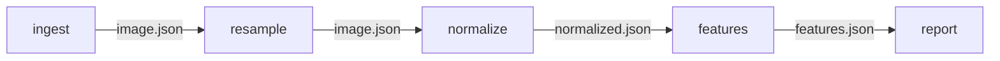

# Synthetic MRI walkthrough

This self-contained example models five deterministic steps in a small research-data pipeline. The
inputs are synthetic JSON fixtures; no medical or personally identifiable data is included.



Each task declares only the source files, configuration fields, environment markers, and upstream
artifact files that can affect its output. `runtime-contract.txt` is deliberately included as a
regular input so runtime-contract changes participate in action keys without pretending to be an
installer lock file.

## Run the example

From the repository root:

```bash
python3 -m venv .venv
.venv/bin/python -m pip install '.[dev]'

.venv/bin/rebuildwhy plan -p examples/synthetic_mri/pipeline.yaml
.venv/bin/rebuildwhy run -p examples/synthetic_mri/pipeline.yaml
.venv/bin/rebuildwhy run -p examples/synthetic_mri/pipeline.yaml
```

The initial plan and first run select `RUN` for all five tasks because no baseline exists. The
second run verifies action records, manifests, objects, and publications before selecting five
`HIT`s.

Generated cache data lives in `examples/synthetic_mri/.rebuildwhy/`. Published paths below
`examples/synthetic_mri/outputs/` are managed symbolic links to immutable cached artifacts. Both
locations are ignored by Git.

## Preview a causal invalidation

This changes a field consumed directly by `resample` in a virtual configuration view:

```bash
.venv/bin/rebuildwhy plan \
  -p examples/synthetic_mri/pipeline.yaml \
  --set 'config/pipeline.yaml#/image/spacing=[1.0,1.0,2.0]'
```

Expected decisions after the baseline run:

| Task | Decision | Reason |
|---|---|---|
| `ingest` | `HIT` | No declared input changed. |
| `resample` | `RUN` | The selected spacing field changed. |
| `normalize` | `MAY_RUN` | The future `resample:image.json` digest is unknown. |
| `features` | `MAY_RUN` | Its upstream artifact chain may change. |
| `report` | `MAY_RUN` | Its upstream artifact chain may change. |

The nested reason graph traces every conditional decision back to
`CONFIG_FIELD_CHANGED: config/pipeline.yaml#/image/spacing`.

## Prove an irrelevant field stays irrelevant

The example config contains a `notes.owner` field that no task selects:

```bash
.venv/bin/rebuildwhy plan \
  -p examples/synthetic_mri/pipeline.yaml \
  --set 'config/pipeline.yaml#/notes/owner="hypothetical"' \
  --json
```

The resulting counterfactual plan has an empty `affected_task_ids` array and five `HIT` decisions.
The source configuration is never edited by either overlay.

## Verify a task twice

After its dependencies have a baseline, opt into a two-run manifest comparison:

```bash
.venv/bin/rebuildwhy verify-determinism features \
  -p examples/synthetic_mri/pipeline.yaml
```

This detects different outputs across two immediate executions. It does not prove that a command is
free of every hidden dependency; see the [trust boundary](../../docs/security-and-trust-boundary.md).
